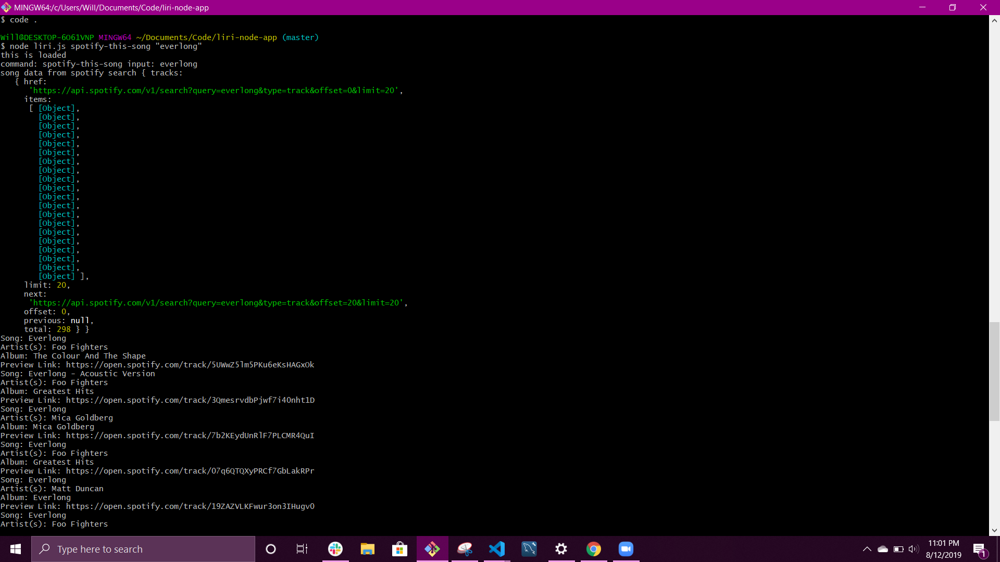
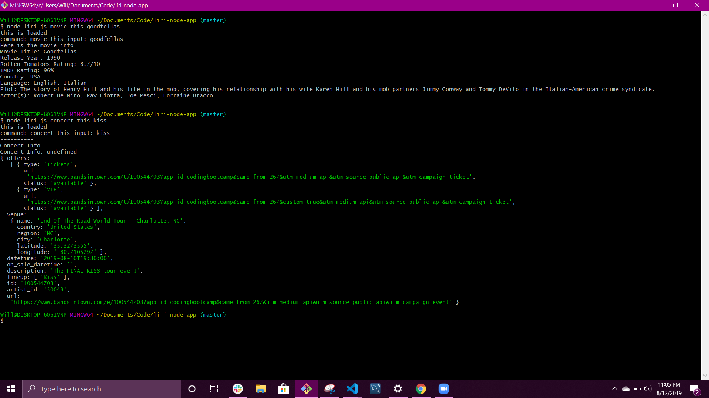

# liri-node-app
The challenge was to use Node JS to create a LIRI bot, similar iPhone's SIRI, but takes in command through Language instead of Speech. LIRI is a command line node app that takes in parameters and returns data based on one of four commands:

concert-this

spotify-this-song

movie-this

do-what-it-says

# What each command does

node liri.js concert-this <artist name>
Shows the upcoming concert venue name, location, and date for the searched artist.
node liri.js song-this <song name>
Shows the following information about the song in terminal/bash window.

Artist(s)
The song's name
A preview link of the song from Spotify
The album that the song is from
Or if no song is passed through, it will default to "Everlong."

node liri.js movie-this <movie name>
Shows the following information in terminal/bash.

Title of the movie.

Year the movie came out.

IMDB Rating of the movie.

Country where the movie was produced.

Language of the movie.

Plot of the movie.

Actors in the movie.

Or if no movie is passed through, it will default to "Goodfellas"

node liri.js do-what-it-says
Takes the text from random.txt and runs the song through spotify-this-song command

# Technologies used
-Javascript

-Node.js

-Moment.js

# Screenshots

